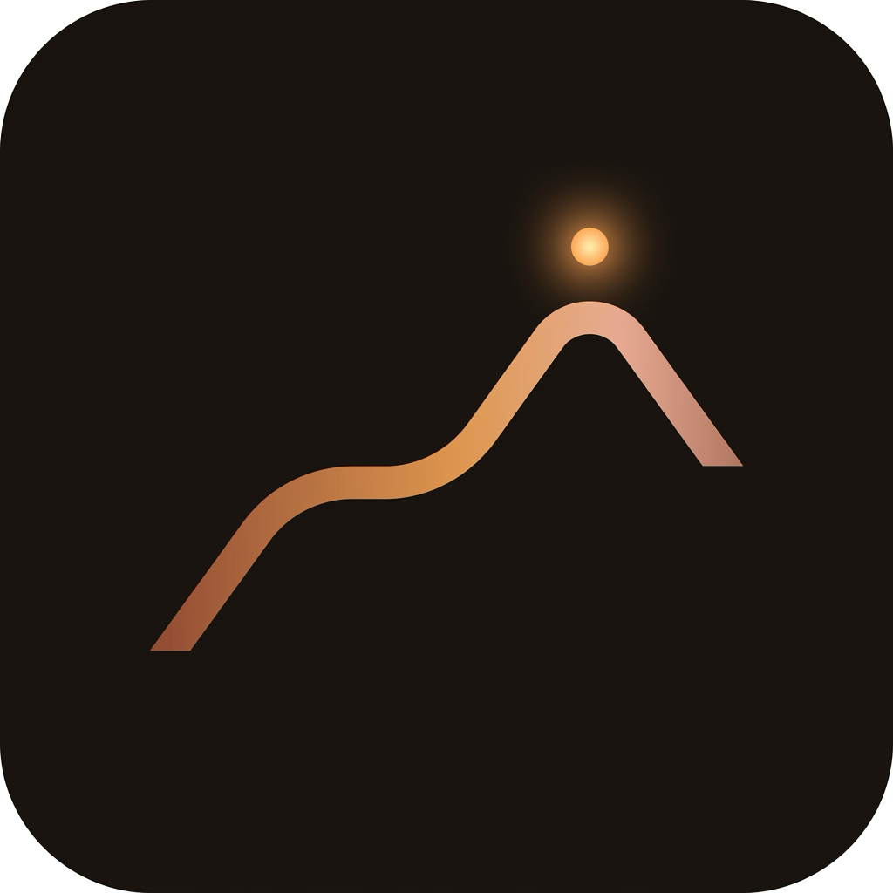
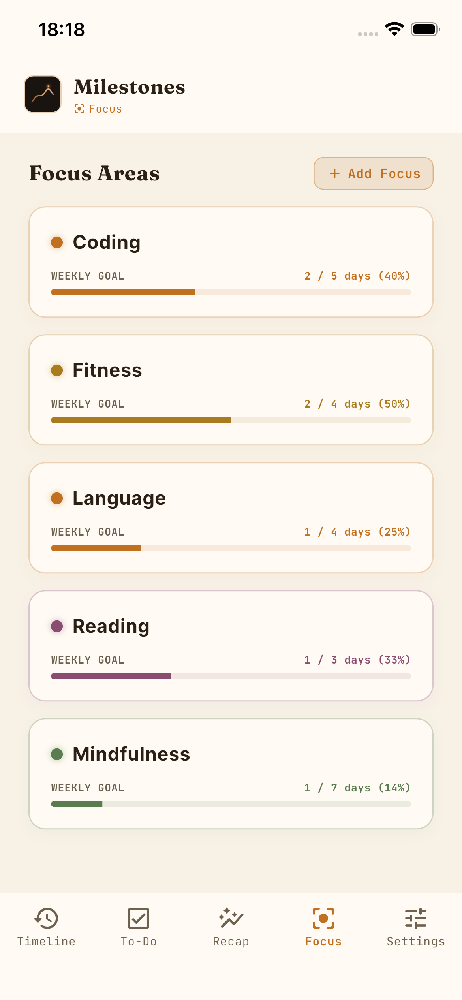
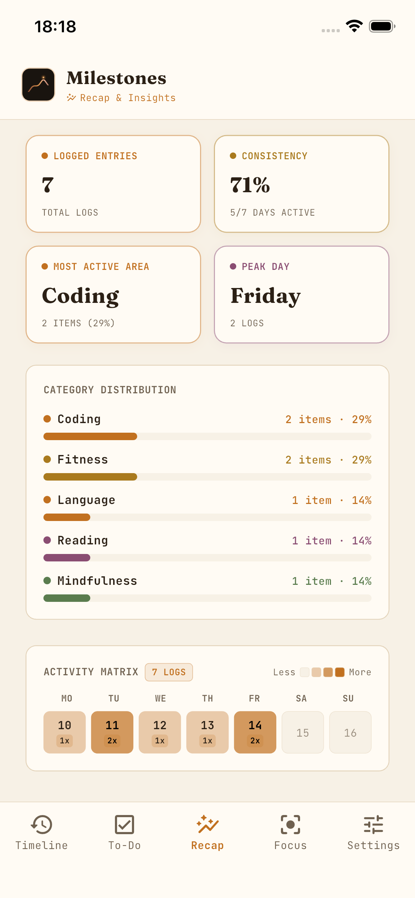
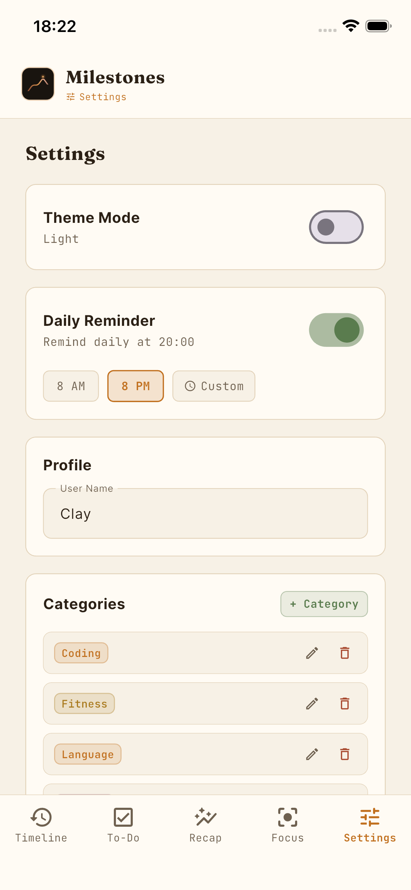

<p align="center">
  
</p>

<h1 align="center">Milestones</h1>

<p align="center">
  A minimalist, local-first personal growth tracker built with Flutter.<br/>
  Log your progress. Reflect on your journey. Stay focused — no account required.
</p>

<p align="center">
  
  
  
  
  
</p>

---

## Screenshots

> _Add your screenshots to a `screenshots/` folder and update the paths below._

| Timeline | Focus Areas | Recap & Insights | Settings |
|:---:|:---:|:---:|:---:|
|  |  |  |  |

---

## Features

### 📅 Timeline
Log daily progress entries tagged to your personal focus categories. Browse your history with month and category filters. Each entry supports optional notes and project tagging. Completing a to-do automatically logs it to your timeline.

### ✅ To-Do
A simple task checklist linked to your focus areas. Checking off a task auto-creates a matching timeline entry — your completion history builds itself.

### 🎯 Focus Areas
Manage everything you're actively working on in one screen:
- **Projects** — multi-step checklists with milestone achievements
- **Skills** — track competency growth (0–100%) with evidence notes
- **Goals** — stage-based progression (customisable stages: e.g. Idea → Research → Prototype → Launch)
- **Categories** — colour-coded focus areas with optional weekly entry targets

### 📖 Recap & Insights
Monthly reflection journal with three sections — *What I achieved*, *Challenges*, and *Plans for next month*. A weekly activity bar chart shows your logging consistency across focus areas.

### 🔔 Daily Reminder
OS-level local notification scheduled at a time you choose. Reminder persists across app restarts. No server, no push tokens — entirely on-device.

### 🌙 Dark / Light Mode
Warm, minimalist palette with a copper accent. Toggled from Settings and persisted in the local database.

### 📤 Backup & Restore
Export your entire database to a JSON file and re-import it on any device. Full data portability — no lock-in.

### 📱 Responsive Layout
- **Mobile / narrow** — bottom navigation bar + top header
- **Tablet / desktop / wide** — persistent sidebar with Quick Log button

---

## Tech Stack

| Layer | Technology |
|---|---|
| Framework | [Flutter](https://flutter.dev) (Dart) |
| State Management | [Riverpod](https://riverpod.dev) 1.x |
| Database | [Drift](https://drift.simonbinder.eu) (SQLite, type-safe ORM) |
| Notifications | [flutter_local_notifications](https://pub.dev/packages/flutter_local_notifications) |
| Fonts | [Google Fonts](https://pub.dev/packages/google_fonts) — Inter, Fraunces |
| Flutter Version | Managed via [FVM](https://fvm.app) (see `.fvmrc`) |

---

## Project Structure

```
milestones/
├── lib/
│   ├── main.dart                    # App entry point, theme setup, shell navigation
│   ├── database/
│   │   ├── database.dart            # Drift schema (9 tables), all CRUD helpers, migrations
│   │   └── database.g.dart          # Auto-generated Drift code (do not edit manually)
│   ├── providers/
│   │   └── state_providers.dart     # Riverpod providers for DB, settings, categories, timeline
│   ├── screens/
│   │   ├── timeline_screen.dart     # Activity feed, weekly chart, month/category filters
│   │   ├── tasks_screen.dart        # To-do checklist with auto-timeline integration
│   │   ├── focus_screen.dart        # Projects, Skills, Goals management
│   │   ├── recap_screen.dart        # Monthly reflection + activity insights
│   │   ├── achievements_screen.dart # Streak counter & win log
│   │   └── settings_screen.dart    # Profile, theme, notifications, categories, backup/restore
│   ├── services/
│   │   └── notification_service.dart  # flutter_local_notifications wrapper
│   └── widgets/
│       ├── common_widgets.dart      # Design system: colours, fonts, theme, shared UI components
│       ├── quick_capture.dart       # Bottom-sheet quick-log modal
│       └── recap_modal.dart         # Monthly recap entry sheet
├── assets/
│   └── app_icon.png                 # App icon source
├── ios/                             # iOS runner (Xcode project)
├── android/                         # Android runner (Gradle project)
├── macos/                           # macOS runner
├── .fvmrc                           # Flutter version pin (FVM)
├── pubspec.yaml                     # Dependencies & asset declarations
└── analysis_options.yaml            # Lint rules
```

### Database Schema (Drift / SQLite)

| Table | Used in | Purpose |
|---|---|---|
| `categories` | Focus Areas screen, all log modals | User-defined focus areas with colour role and optional weekly target |
| `entries` | Timeline screen, Recap screen, Wins & Streaks screen | Timeline log entries, each linked to a category |
| `todos` | Tasks screen (raw SQL) | Checklist items; completion auto-creates a linked timeline entry |
| `user_settings` | Settings screen, app-wide theme & notifications | Profile name, dark/light theme preference, reminder config |

---

## Getting Started

### Prerequisites

| Tool | Version |
|---|---|
| Flutter | `3.44.8` (pinned via FVM — see `.fvmrc`) |
| Dart | `≥ 3.12.0` |
| Xcode | 15+ (for iOS / macOS builds) |
| Android Studio / SDK | API 21+ (for Android builds) |
| FVM _(optional but recommended)_ | [fvm.app](https://fvm.app) |

### 1 — Clone the repo

```bash
git clone https://github.com/yourusername/milestones.git
cd milestones
```

### 2 — Install the correct Flutter version (with FVM)

```bash
# Install FVM if you don't have it
dart pub global activate fvm

# Install the pinned Flutter version and fetch dependencies
fvm install
fvm flutter pub get
```

Or skip FVM and use a globally installed Flutter (≥ 3.x):

```bash
flutter pub get
```

### 3 — Run the app

```bash
# With FVM
fvm flutter run

# Without FVM
flutter run
```

### 4 — Build for release

```bash
# iOS
fvm flutter build ios --release

# Android
fvm flutter build apk --release

# macOS
fvm flutter build macos --release
```

### Regenerating database code

If you modify the Drift schema in `lib/database/database.dart`, regenerate the generated file:

```bash
fvm dart run build_runner build --delete-conflicting-outputs
```

> **Note:** `lib/database/database.g.dart` is committed to the repo so you don't need to run the generator just to build the app.

---

## Design System

The app uses a warm, dark-first design palette defined in `lib/widgets/common_widgets.dart`.

| Role | Dark colour | Light colour | Used for |
|---|---|---|---|
| **Copper** | `#e08a3e` | `#c1701f` | Learning, primary accent, active nav |
| **Gold** | `#dda63f` | `#a97a1e` | Wins & Streaks, achievement badges |
| **Plum** | `#a2688c` | `#8a4d72` | Category accent colour option |
| **Sage** | `#86a878` | `#5a7c4e` | Neutral / success states |
| **Rose** | `#c9634c` | `#a8492f` | Destructive actions |

All colours have light-mode equivalents with adjusted contrast. Typography uses **Inter** (UI text) and **Fraunces** (headings) via Google Fonts.

---

## Data & Privacy

All data is stored **100% locally** on your device in a SQLite database (`milestone.sqlite` in the app's documents directory). Nothing is sent to any external server. You can export a full JSON backup or delete everything from the Settings screen at any time.

---

## Contributing

Pull requests are welcome. For significant changes, please open an issue first to discuss what you'd like to change.

1. Fork the repo
2. Create your feature branch: `git checkout -b feat/your-feature`
3. Commit your changes: `git commit -m 'feat: add your feature'`
4. Push to the branch: `git push origin feat/your-feature`
5. Open a Pull Request

---

## License

MIT — see [LICENSE](LICENSE) for details.
